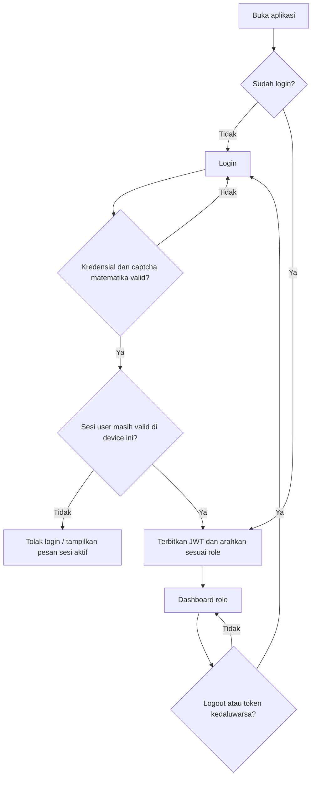
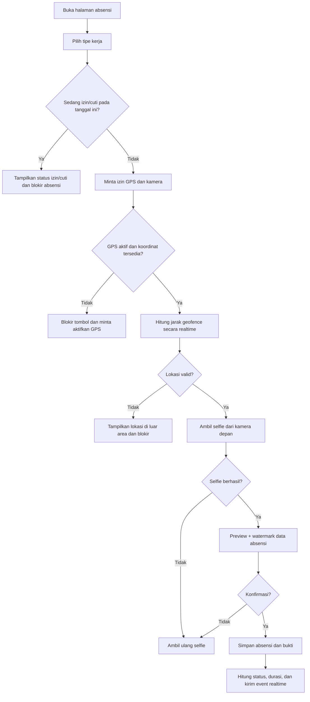
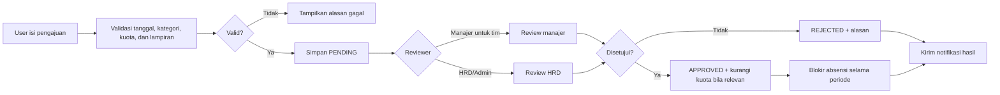
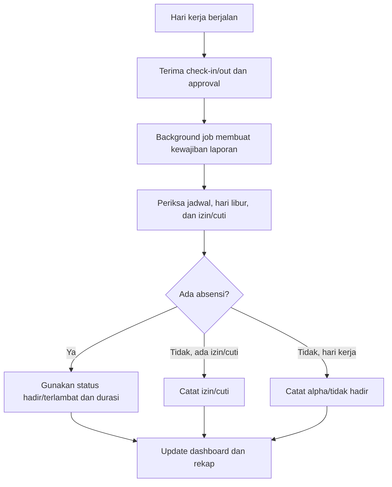

# Workflow Sistem Absensi Golan

Dokumen ini menjelaskan alur bisnis utama aplikasi Absensi Golan Digital Kreatif, pembagian akses setiap role, status data, dan aturan validasi yang perlu dijaga antara frontend dan backend.

## 1. Role dan ruang lingkup akses

| Role      | Fokus utama                                                        | Scope data                         |
| --------- | ------------------------------------------------------------------ | ---------------------------------- |
| Karyawan  | Absensi, riwayat, izin/cuti, laporan kerja, profil                 | Data pribadi                       |
| Magang    | Absensi, izin, laporan kerja, logbook, mentor, sertifikat          | Data pribadi dan logbook sendiri   |
| Manajer   | Dashboard, absensi tim, laporan tim, approval izin, review logbook | Tim yang menjadi tanggung jawabnya |
| HRD/Admin | Master data, konfigurasi, approval, rekap, audit, operasional      | Seluruh organisasi                 |

Semua endpoint yang memuat atau mengubah data wajib memvalidasi JWT dan role/scope di backend. Route guard frontend hanya menjadi lapisan tambahan.

## 2. Alur umum autentikasi

Alur pendukung:

1. **Lupa password**: user mengirim email terdaftar, menerima token reset, lalu membuat password baru.
2. **Logout**: sesi/token dihapus dan user dikembalikan ke halaman login.
3. **Satu akun satu sesi**: login dari device lain harus ditolak atau menggantikan sesi lama sesuai kebijakan backend; status sesi tidak boleh hanya dikontrol frontend.

## 3. Alur absensi check-in dan check-out

### 3.1 Check-in

1. User memilih tipe kerja aktif: **WFO**, **WFH**, atau tipe custom.
2. Browser meminta GPS. Selama halaman terbuka, posisi diperbarui menggunakan pemantauan lokasi, bukan hanya satu pembacaan awal.
3. Sistem memilih geofence berdasarkan tipe kerja:
   - WFO: radius kantor.
   - WFH: radius kantor atau radius rumah user jika sudah dikonfigurasi.
   - Custom: mengikuti aturan geofence tipe kerja tersebut.
4. User mengambil selfie langsung dari kamera depan. Upload foto dari galeri tidak digunakan untuk absensi.
5. Sistem menyimpan waktu, koordinat, akurasi, tipe kerja, geofence yang cocok, snapshot/peta bila tersedia, dan URL selfie.
6. Backend menentukan status berdasarkan jadwal user dan tanggal bisnis.

### 3.2 Check-out

1. User membuka menu check-out setelah check-in berhasil.
2. Sistem mengulangi validasi GPS, geofence, dan selfie.
3. Backend menyimpan waktu pulang lalu menghitung durasi kerja.
4. Jika user belum check-in, check-out ditolak dengan pesan yang jelas.

### 3.3 Status absensi

| Kondisi                                 | Status yang disimpan/ditampilkan                    |
| --------------------------------------- | --------------------------------------------------- |
| Check-in sampai batas toleransi         | Hadir                                               |
| Check-in melewati toleransi             | Terlambat; durasi terlambat tetap dicatat untuk HRD |
| Tidak ada check-in pada tanggal kerja   | Alpha/tidak hadir setelah proses penutupan harian   |
| Sedang memiliki izin/cuti disetujui     | Izin atau Cuti; tetap muncul di rekap harian        |
| Check-in ada tetapi check-out belum ada | Hadir, belum check-out                              |

Status keterlambatan dapat disembunyikan dari tampilan karyawan/magang sesuai kebijakan UI, tetapi data keterlambatan tetap tersedia untuk HRD dan laporan.

## 4. Alur izin dan cuti

Aturan penting:

- Tanggal mulai tidak boleh lebih kecil dari hari berjalan.
- Pengajuan harus memiliki kategori, tanggal mulai/selesai, alasan, dan lampiran jika diwajibkan kategori tersebut.
- Karyawan yang belum melewati masa minimum kerja tiga bulan hanya dapat mengajukan kategori yang diizinkan kebijakan, misalnya sakit.
- Saat approval cuti/izin disetujui, kuota berkurang untuk kategori yang memakai kuota.
- Setiap tanggal dalam periode approved harus tetap muncul di rekap absensi sebagai Izin/Cuti.
- User tidak boleh check-in maupun check-out selama periode izin/cuti aktif.
- Perubahan status mengirim notifikasi kepada pemohon dan reviewer terkait.

## 5. Alur laporan kerja dan logbook

### 5.1 Laporan kerja karyawan/manajer

1. Sistem membuat kewajiban laporan harian secara otomatis melalui proses background.
2. User mengisi kolom laporan dan mengunggah lampiran bila diperlukan.
3. User menyimpan sebagai draft atau mengirim laporan.
4. HRD melihat daftar laporan, status validasi, dan kepatuhan harian.
5. Jika melewati batas waktu tanpa laporan, sistem menandai **Tidak membuat laporan kerja** dan memasukkannya ke tindak lanjut dashboard.

Status minimal: `DRAFT`, `SUBMITTED`, `APPROVED`, `REJECTED`, dan `TIDAK_MEMBUAT_LAPORAN`.

### 5.2 Logbook magang

1. Peserta magang membuat atau mengedit logbook miliknya.
2. Logbook dapat disimpan sebagai draft atau dikirim untuk review.
3. Manajer pembimbing melakukan review dan mengisi catatan review.
4. Manajer mengubah hasil menjadi disetujui atau ditolak.
5. HRD memantau hasil review dan kepatuhan, tetapi bukan reviewer utama logbook.
6. Setelah periode magang berakhir, HRD dapat mengunggah atau menerbitkan sertifikat sesuai kewenangan.

## 6. Alur operasional HRD/Admin

Urutan konfigurasi yang disarankan setelah instalasi:

1. Atur informasi umum perusahaan dan lokasi kantor beserta radius geofence.
2. Buat divisi, jabatan, project/team, dan user manajer.
3. Tambahkan karyawan/magang, role, jadwal/shift, dan lokasi rumah untuk WFH bila diperlukan.
4. Atur tipe kerja, aturan izin/cuti, kuota, hari libur, dan pengaturan notifikasi.
5. Kelola event perusahaan agar tampil di kalender seluruh role yang berwenang.
6. Pantau dashboard, approval, laporan kerja, alpha, dan audit log.
7. Export rekap sesuai periode: harian, mingguan, bulanan, atau laporan alpha.
8. Jalankan backup database secara berkala.

## 7. Alur dashboard dan realtime

Setelah login, user diarahkan ke dashboard berdasarkan role:

| Role     | Halaman utama          | Data utama                                                       |
| -------- | ---------------------- | ---------------------------------------------------------------- |
| Karyawan | `/employee/dashboard`  | Status absensi pribadi, statistik, laporan, agenda, notifikasi   |
| Magang   | `/intern/dashboard`    | Absensi, logbook, mentor, progres, sertifikat, agenda            |
| Manajer  | `/manager/dashboard`   | Status tim, laporan tim, approval, review logbook, agenda        |
| HRD      | `/admin/dashboard`     | Rekap organisasi, belum absen, izin/cuti, laporan, tindak lanjut |
| Manajer | `/manager/dashboard` | Ringkasan tim, absensi, statistik, dan laporan     |

Perubahan absensi, izin/cuti, laporan, logbook, dan notifikasi dikirim sebagai event realtime jika koneksi tersedia. Client melakukan refresh agregat yang relevan berdasarkan scope user. Jika WebSocket gagal, gunakan polling terkontrol dengan reconnect exponential backoff dan hentikan polling setelah koneksi kembali.

Event utama:

`attendance.created`, `attendance.updated`, `leave.created`, `leave.updated`, `work_report.created`, `work_report.updated`, `logbook.created`, `logbook.updated`, `notification.created`, dan `dashboard.refresh`.

Event harus difilter backend berdasarkan user, role, divisi, dan team. Data dari team lain tidak boleh dikirim ke browser.

## 8. Penutupan hari dan pembentukan rekap

Tanggal bisnis harus mengikuti timezone **Asia/Jakarta (WIB)** dan konfigurasi shift, termasuk shift yang melewati tengah malam. Rekap harus mencakup seluruh karyawan yang aktif dan baris izin/cuti pada setiap tanggal dalam periodenya.

## 9. Aturan keamanan dan audit

- Data selfie, koordinat, alamat rumah, dan lampiran hanya dapat diakses oleh pemilik, HRD, dan role yang berwenang.
- Semua perubahan master data, absensi administratif, approval, penghapusan, dan perubahan konfigurasi dicatat ke audit log.
- Validasi geofence dilakukan ulang di backend menggunakan koordinat dan radius tersimpan; hasil dari frontend tidak boleh dipercaya sebagai satu-satunya validasi.
- Upload file harus memeriksa ukuran, MIME type, ekstensi, dan nama file; file tidak boleh dieksekusi sebagai kode.
- Response API tidak mengirim data sensitif yang tidak diperlukan oleh halaman.
- Operasi gagal harus mengembalikan pesan yang spesifik tanpa membocorkan detail internal database.

## 10. Checklist verifikasi end-to-end

- Login berhasil mengarahkan setiap role ke dashboard yang benar.
- User tanpa role yang sesuai mendapat `403` saat membuka URL langsung.
- Check-in ditolak jika GPS mati, di luar radius, kamera ditolak, selfie belum ada, atau user sedang izin/cuti.
- Check-in dan check-out berhasil menyimpan tipe kerja, lokasi, akurasi, selfie, dan timestamp WIB.
- Karyawan yang belum check-in muncul sebagai alpha setelah proses penutupan hari.
- Izin/cuti approved tetap muncul pada setiap tanggal periodenya dan mengurangi kuota jika berlaku.
- Laporan kerja yang terlewat menjadi `Tidak membuat laporan`.
- Logbook direview manajer dan hasilnya terlihat oleh HRD.
- Event realtime hanya diterima user yang memiliki scope.
- Export rekap mengikuti filter tanggal/role/divisi dan tidak membocorkan data lintas scope.
- Tampilan tabel tetap dapat digunakan pada mobile dan mode gelap.
