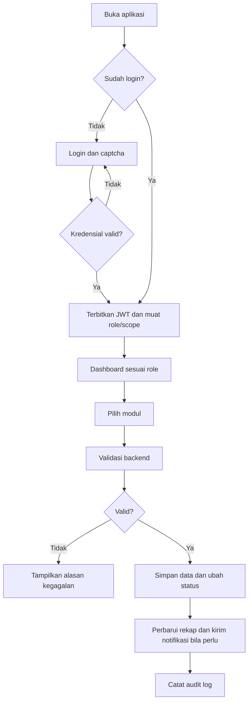
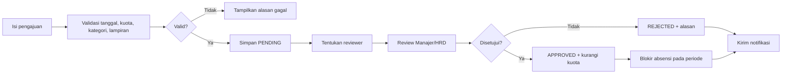

# DOKUMEN ALUR SISTEM INFORMASI ABSENSI GOLAN

> **Catatan terminologi terbaru:** seluruh alur peserta magang menggunakan **Laporan Kerja**.
> Tidak ada menu atau workflow aktif terpisah untuk pencatatan harian.

Dokumen ini disusun sebagai acuan awal dalam pengembangan, pengujian, dan pemeliharaan Sistem Informasi Absensi Golan Digital Kreatif. Dokumen menjelaskan konsep alur sistem dan kerangka dokumen yang akan digunakan untuk mendokumentasikan aturan bisnis, proses pengguna, hak akses, status data, serta kebutuhan teknis sistem.

Dokumen ini mencakup bagian **1. Konsep Alur Sistem**, **2. Kerangka Alur Sistem**, dan **3. Dokumen Alur Sistem Informasi Absensi Golan**. Bagian 3 disusun dengan mengadaptasi struktur dokumen referensi SIMKEU dan menyesuaikan isinya dengan fitur serta implementasi project Absensi Golan.

## 1. Konsep Alur Sistem

Pada dasarnya, dokumen alur sistem menjelaskan hubungan antara kebutuhan bisnis, fitur aplikasi, dan implementasi teknis pada Sistem Informasi Absensi Golan. Dokumen ini menjadi acuan bersama bagi pemilik sistem, pengguna, pengembang, dan penguji agar proses yang dibangun memiliki aturan dan batasan yang jelas.

### 1.1 Tujuan Dokumen

Dokumen alur sistem digunakan untuk:

1. Menjelaskan alasan dan tujuan dibangunnya sistem absensi digital.
2. Mendefinisikan ruang lingkup fitur dan proses yang dilayani oleh sistem.
3. Menjelaskan perbedaan hak akses Karyawan, Magang, Manajer, dan HRD/Admin.
4. Menjadi acuan dalam merancang alur absensi, izin/cuti, laporan kerja, dan proses magang.
5. Menjadi rujukan saat melakukan pengembangan, pengujian UAT, pelacakan masalah, dan pemeliharaan sistem.
6. Menjaga agar validasi penting dilakukan secara konsisten pada frontend dan backend.

### 1.2 Tiga Sudut Pandang Alur Sistem

| No. | Kategori | Pertanyaan yang Dijawab | Isi Utama pada Sistem Absensi Golan |
|---:|---|---|---|
| 1 | Bisnis | Mengapa sistem dibuat dan siapa yang menggunakannya? | Latar belakang absensi digital, tujuan, ruang lingkup, jenis pengguna, hak akses, dan aturan operasional kehadiran. |
| 2 | Produk | Fitur apa yang tersedia dan bagaimana pengguna menjalankan prosesnya? | Struktur navigasi, fitur per role, alur login, check-in/check-out, izin/cuti, laporan kerja peserta magang, approval, dan status data. |
| 3 | Teknis | Bagaimana sistem dibangun dan dijaga keamanannya? | Arsitektur Angular dan Go, API, database, autentikasi JWT, validasi GPS/selfie, audit log, penyimpanan berkas, notifikasi realtime, dan operasional sistem. |

### 1.3 Prinsip Dasar Sistem

| Prinsip | Penerapan pada Sistem Absensi Golan |
|---|---|
| Satu sumber data | Data absensi, izin/cuti, laporan kerja, dan data pengguna disimpan secara terpusat agar rekap tidak bergantung pada pencatatan manual. |
| Validasi berlapis | Validasi pada tampilan membantu pengguna, sedangkan backend tetap menjadi sumber kebenaran untuk autentikasi, role, tanggal, GPS, status, dan izin akses. |
| Akuntabilitas | Persetujuan, perubahan data penting, dan aktivitas administrasi dicatat melalui audit log. |
| Pembatasan akses | Pengguna hanya dapat melihat atau mengubah data sesuai role dan scope organisasi yang dimilikinya. |
| Bukti kehadiran | Check-in dan check-out menggunakan waktu, lokasi, akurasi GPS, tipe kerja, dan foto selfie sebagai bukti proses absensi. |
| Konsistensi status | Setiap proses memiliki status yang jelas agar pengguna mengetahui posisi proses dan tindakan berikutnya. |
| Responsif dan mudah digunakan | Antarmuka mendukung penggunaan desktop dan perangkat mobile, termasuk mode gelap serta tabel dan laporan yang dapat digunakan pada layar kecil. |

### 1.4 Ruang Lingkup Konseptual

Sistem dipahami sebagai rangkaian berikut:

```text
Pengguna masuk ke sistem
        ↓
Sistem mengenali role dan scope pengguna
        ↓
Pengguna mengakses fitur sesuai kewenangan
        ↓
Sistem memvalidasi data dan aturan bisnis
        ↓
Data tersimpan, status diperbarui, dan notifikasi dikirim bila diperlukan
        ↓
Data ditampilkan dalam dashboard, riwayat, rekap, laporan, atau audit log
```

### 1.5 Manfaat Sistem

Implementasi Sistem Informasi Absensi Golan Digital Kreatif diharapkan memberikan manfaat sebagai berikut.

1. **Meningkatkan efisiensi operasional perusahaan.** Proses check-in/check-out, pengajuan izin dan cuti, pengisian laporan kerja, review, rekap, serta pelaporan dilakukan melalui satu platform. Hal ini mengurangi ketergantungan pada formulir, pesan pribadi, dan spreadsheet yang terpisah.

2. **Mengurangi kesalahan pencatatan dan perhitungan.** Sistem memvalidasi waktu, jadwal, tipe kerja, lokasi, geofence, foto selfie, status pengajuan, kuota, dan hak akses. Perhitungan keterlambatan, durasi kerja, status kehadiran, serta rekap periode menjadi lebih konsisten.

3. **Menyediakan informasi kehadiran yang aktual.** Karyawan dapat melihat status, riwayat, dan statistik absensinya. Manajer dapat memantau kehadiran anggota tim, sedangkan HRD/Admin dapat melihat rekap organisasi tanpa menunggu pengumpulan data manual.

4. **Meningkatkan kualitas dan akuntabilitas laporan kerja.** Laporan kerja dapat dikumpulkan secara terstruktur berdasarkan tanggal atau periode, kegiatan, proyek, hasil pekerjaan, dan informasi pendukung. Manajer dapat meninjau laporan anggota tim, memberikan persetujuan atau catatan perbaikan, serta menindaklanjuti laporan yang terlambat atau belum dibuat.

5. **Mendukung evaluasi produktivitas dan beban kerja.** Data laporan kerja yang terhubung dengan periode dan identitas pengguna dapat menjadi bahan evaluasi penyelesaian kegiatan, konsistensi pelaporan, distribusi pekerjaan, dan kebutuhan tindak lanjut. Data ini menjadi informasi pendukung dan tidak menggantikan penilaian kinerja menyeluruh sesuai kebijakan perusahaan.

6. **Mempercepat dan memperjelas proses izin serta cuti.** Pengguna dapat mengajukan izin/cuti dengan data dan lampiran yang lengkap, kemudian memantau statusnya. Reviewer dapat memproses pengajuan sesuai kewenangan, sedangkan sistem memvalidasi konflik tanggal, kuota, kategori, dan dampaknya terhadap absensi.

7. **Meningkatkan transparansi proses approval.** Status pending, approved, rejected, atau cancelled serta alasan penolakan dan catatan reviewer dapat terdokumentasi sehingga pengaju mengetahui tindak lanjut yang diperlukan.

8. **Mendukung pengelolaan peserta magang secara terintegrasi.** Peserta Magang dapat mengelola Laporan Kerja, melihat mentor, memantau progres, mengakses dokumen yang menjadi haknya, dan memperoleh informasi sertifikat sesuai ketentuan. Mentor, Manajer, dan HRD dapat melakukan review sesuai scope kewenangan.

9. **Memperkuat pengawasan dan pengambilan keputusan manajerial.** Dashboard, statistik, rekap harian/mingguan/bulanan, serta laporan keterlambatan, alpha, belum check-out, izin/cuti, dan kepatuhan laporan kerja memberikan dasar informasi untuk tindak lanjut operasional dan evaluasi kebijakan kerja.

10. **Meningkatkan keamanan dan pembatasan akses data.** Validasi JWT, role, permission, dan scope memastikan pengguna hanya mengakses data sesuai kewenangannya. Backend menjadi pengaman utama untuk seluruh endpoint yang memuat atau mengubah data.

11. **Meningkatkan akuntabilitas dan kemudahan audit.** Aktivitas penting, perubahan status, proses approval, perubahan konfigurasi, dan akses tertentu dapat ditelusuri melalui audit log sehingga pemeriksaan internal dan investigasi perbedaan data menjadi lebih mudah.

12. **Mendukung fleksibilitas pola kerja.** Dukungan terhadap WFO, WFH, dan tipe kerja custom memungkinkan perusahaan menerapkan aturan kerja sesuai kebutuhan, dengan validasi lokasi kantor atau lokasi rumah yang telah dikonfigurasi.

13. **Meningkatkan pengalaman pengguna.** Antarmuka responsif, status proses yang jelas, notifikasi, pesan kesalahan yang mudah dipahami, dan dukungan desktop maupun perangkat mobile membantu pengguna menyelesaikan tugas dengan lebih mudah.

14. **Menyediakan satu sumber data terpusat dan berkelanjutan.** Data absensi, izin/cuti, laporan kerja, pengguna, jadwal, lokasi, dan konfigurasi tersimpan secara terhubung. Data historis tetap dipertahankan ketika akun, tipe kerja, atau konfigurasi dinonaktifkan.

15. **Mendukung peningkatan proses secara berkelanjutan.** Rekap keterlambatan, pengajuan izin/cuti, kepatuhan laporan, hasil review, dan catatan audit dapat digunakan untuk menemukan kendala berulang serta menentukan perbaikan prosedur, konfigurasi, pelatihan pengguna, atau pengembangan fitur berikutnya.

## 2. Kerangka Alur Sistem

Bagian ini menetapkan struktur dokumen rinci yang akan dikembangkan pada bagian 3. Setiap topik di bawah akan berisi aturan dan alur yang disesuaikan dengan kondisi aktual Sistem Informasi Absensi Golan.

### 2.1 Ringkasan dan Changelog — Kategori Bisnis

Berisi identitas dokumen, versi, tanggal, perubahan utama, sumber kebutuhan, serta status keputusan. Setiap kebutuhan atau keputusan diberi status:

- **FINAL** — telah disepakati dan dapat dijadikan acuan implementasi atau pengujian.
- **PENDING** — masih membutuhkan keputusan, data pendukung, atau klarifikasi sebelum dijadikan aturan final.

Bagian ini juga mencatat perubahan terhadap aturan absensi, role, approval, laporan, konfigurasi lokasi, dan modul magang.

### 2.2 Gambaran Umum Proyek — Kategori Bisnis

Menjelaskan identitas Sistem Informasi Absensi Golan Digital Kreatif, latar belakang masalah absensi manual, tujuan digitalisasi, target pengguna, dan konsep utama sistem.

Isi minimum:

- nama perusahaan dan nama sistem;
- latar belakang serta masalah yang hendak diselesaikan;
- tujuan sistem;
- target pengguna;
- konsep absensi berbasis web;
- ringkasan hubungan absensi, izin/cuti, laporan kerja, dan proses magang.

### 2.3 Ruang Lingkup — Kategori Bisnis

Membedakan fitur yang termasuk dalam pengembangan dan fitur yang berada di luar ruang lingkup.

Ruang lingkup utama yang perlu didokumentasikan meliputi:

- autentikasi dan pengaturan sesi;
- absensi check-in dan check-out;
- tipe kerja, validasi GPS, dan foto selfie;
- riwayat serta rekap absensi;
- pengajuan dan approval izin/cuti;
- dashboard statistik dan laporan;
- manajemen karyawan, organisasi, role, dan konfigurasi;
- laporan kerja dan alur review manajer;
- fitur magang, yaitu Laporan Kerja, mentor, statistik, dokumen, dan sertifikat;
- notifikasi, event realtime, backup, dan audit.

Fitur yang belum disepakati atau tidak dibangun pada fase ini harus dicatat secara eksplisit sebagai di luar ruang lingkup atau **PENDING**.

### 2.4 Jenis Pengguna dan Hak Akses — Kategori Bisnis

Berisi role, fokus penggunaan, cakupan data, kewenangan, dan batasan masing-masing pengguna.

| Jenis Pengguna | Fokus Penggunaan | Cakupan Data |
|---|---|---|
| Karyawan | Absensi, riwayat, izin/cuti, laporan kerja, profil, dan notifikasi | Data pribadi serta proses yang diajukan sendiri |
| Magang | Absensi, izin yang tersedia, laporan kerja, mentor, statistik, dokumen, dan sertifikat | Data pribadi, laporan kerja, dan dokumen magang sendiri |
| Manajer | Dashboard, pemantauan absensi tim, laporan tim, approval izin, serta review Laporan Kerja | Data anggota tim yang menjadi tanggung jawabnya |
| HRD/Admin | Master data, konfigurasi, approval, rekap, audit, backup, dan operasional sistem | Seluruh data organisasi sesuai kewenangan administratif |

Detail permission per menu dan pembatasan endpoint backend akan dijabarkan dalam dokumen bagian 3.

### 2.5 Aturan Bisnis — Kategori Bisnis

Menjelaskan ketentuan operasional yang harus dipenuhi sebelum suatu proses dinyatakan berhasil.

Topik aturan bisnis yang perlu dirinci:

- ketentuan login, captcha, token, dan satu sesi pengguna;
- tipe kerja WFO, WFH, dan tipe custom;
- validasi GPS, geofence kantor/rumah, akurasi lokasi, dan foto selfie;
- perhitungan hadir, terlambat, alpha, izin, cuti, dan belum check-out;
- jam kerja, shift, hari kerja, hari libur, dan toleransi keterlambatan;
- tanggal, kuota, kategori, lampiran, dan approval izin/cuti;
- pembatasan pengajuan berdasarkan status atau masa kerja;
- pembagian approval antara Manajer dan HRD/Admin;
- kewajiban laporan kerja serta batas waktu pengumpulan;
- status dan review Laporan Kerja peserta magang;
- pengiriman notifikasi dan pencatatan aktivitas.

### 2.6 Sitemap dan Struktur Navigasi — Kategori Produk

Menjelaskan hubungan halaman publik, halaman autentikasi, dashboard berdasarkan role, dan halaman fitur. Struktur minimal yang akan dipetakan mencakup:

```text
Beranda publik
└── Autentikasi
    ├── Login
    ├── Lupa password
    ├── Reset password
    └── Verifikasi OTP

Area pengguna
├── Dashboard
├── Absensi / Check-in
├── Riwayat absensi
├── Izin dan cuti
├── Laporan kerja
├── Notifikasi
└── Profil

Area Manajer
├── Dashboard tim
├── Absensi tim
├── Laporan tim
├── Approval izin
└── Review Laporan Kerja

Area HRD/Admin
├── Dashboard administrasi
├── Manajemen karyawan dan organisasi
├── Role dan operasi
├── Tipe kerja, shift, jadwal, dan hari libur
├── Approval dan rekap absensi
├── Laporan keterlambatan dan laporan kerja
├── Audit
├── Notifikasi
└── Backup

Area Magang
├── Dashboard magang
├── Laporan Kerja
├── Mentor
├── Statistik magang
├── Dokumen magang
└── Sertifikat
```

### 2.7 Daftar Fitur per Modul dan Role — Kategori Produk

Setiap fitur didokumentasikan dengan format nama fitur, tujuan, pengguna yang berhak, data masukan, hasil proses, dan batasan akses.

Modul yang akan dijabarkan:

1. Autentikasi dan manajemen sesi.
2. Dashboard dan statistik.
3. Check-in/check-out dan riwayat absensi.
4. Tipe kerja, geofence, lokasi rumah, dan selfie.
5. Izin/cuti dan approval.
6. Laporan kerja dan review manajer.
7. Manajemen karyawan, organisasi, role, dan permission.
8. Jadwal kerja, shift, hari kerja, dan hari libur.
9. Notifikasi dan event realtime.
10. Audit log dan backup.
11. Fitur khusus peserta magang.

### 2.8 Alur Pengguna dan Activity Diagram — Kategori Produk

Menjelaskan langkah dari awal hingga selesai untuk proses utama, termasuk validasi, percabangan, pesan gagal, perubahan status, dan hasil akhir.

Diagram yang perlu disiapkan pada bagian 3:

- alur autentikasi;
- alur check-in;
- alur check-out;
- alur pengajuan dan approval izin/cuti;
- alur pembuatan, pengumpulan, dan review laporan kerja;
- alur pengisian dan review laporan kerja peserta magang;
- alur manajemen karyawan oleh HRD/Admin;
- alur rekap dan ekspor laporan;
- alur notifikasi realtime.

### 2.9 Status atau State Machine per Entitas — Kategori Produk

Berisi status yang mungkin dimiliki entitas, pemicu perpindahan status, role yang berwenang mengubahnya, dan kondisi gagal atau pembatalan.

Entitas yang perlu didokumentasikan:

- sesi dan akun pengguna;
- record absensi;
- pengajuan izin/cuti;
- laporan kerja;
- laporan kerja peserta magang;
- dokumen dan sertifikat magang;
- tipe kerja;
- data karyawan;
- notifikasi;
- audit log.

### 2.10 Persyaratan Teknis — Kategori Teknis

Menjelaskan teknologi dan layanan yang digunakan atau menjadi batasan implementasi, sekurang-kurangnya:

- frontend Angular dan TypeScript;
- backend Go dengan Fiber;
- basis data relasional dan migration;
- REST API serta WebSocket untuk event realtime;
- autentikasi JWT dan middleware role;
- Geolocation API, kamera browser, dan validasi jarak haversine;
- penyimpanan file/object storage untuk foto dan dokumen;
- ekspor laporan PDF/Excel atau format yang didukung aplikasi;
- konfigurasi environment, deployment, logging, dan backup;
- kebutuhan browser, perangkat, jaringan, dan responsivitas.

### 2.11 Security dan Governance — Kategori Teknis

Menjelaskan mekanisme perlindungan sistem dan tata kelola data, meliputi:

- autentikasi, otorisasi, route guard, dan validasi backend;
- hashing password, token, captcha, OTP, dan manajemen sesi;
- pembatasan akses berdasarkan role dan scope data;
- validasi file, ukuran file, MIME type, dan keamanan penyimpanan;
- perlindungan data lokasi, foto selfie, dokumen, dan informasi pribadi;
- audit log untuk perubahan dan aktivitas penting;
- validasi ulang GPS dan aturan bisnis di backend;
- sanitasi input, penanganan error, serta perlindungan endpoint;
- backup, retensi, pemulihan data, dan pengelolaan akses administrator.

### 2.12 SLA dan Operasional Harian — Kategori Teknis

Menjelaskan target waktu dan tanggung jawab pada proses yang membutuhkan tindakan manusia atau proses operasional rutin.

Proses yang perlu ditentukan SLA-nya:

- review dan approval izin/cuti;
- review laporan kerja;
- review Laporan Kerja peserta magang;
- pemutakhiran master data karyawan;
- penanganan koreksi absensi;
- pemantauan notifikasi dan event gagal;
- backup serta pemeriksaan hasil backup;
- penanganan insiden dan eskalasi jika proses melewati target.

## 3. Dokumen Alur Sistem Informasi Absensi Golan

### 3.1 Tujuan Dokumen

Dokumen ini menjelaskan alur operasional Sistem Informasi Absensi Golan Digital Kreatif, mulai dari autentikasi pengguna, pencatatan check-in dan check-out, validasi lokasi dan foto selfie, pengajuan izin/cuti, laporan kerja, proses magang, sampai penyajian dashboard, rekap, notifikasi, dan audit.

Dokumen ini menjadi acuan untuk:

- pengembangan dan pemeliharaan sistem;
- penyamaan pemahaman antara PT. Golan Digital Kreatif, pengguna, pengembang, dan penguji;
- penentuan hak akses dan cakupan data setiap role;
- penyusunan skenario UAT;
- penelusuran perubahan data melalui audit log.

### 3.2 Aktor Sistem

| Aktor | Peran Utama |
|---|---|
| Karyawan | Melakukan check-in/check-out, melihat riwayat dan statistik pribadi, mengajukan izin/cuti, mengisi laporan kerja, melihat notifikasi, dan mengelola profil. |
| Magang | Melakukan absensi, melihat riwayat dan statistik pribadi, mengajukan proses yang tersedia, mengisi Laporan Kerja, melihat mentor, mengelola dokumen, dan mengakses sertifikat magang. |
| Manajer | Memantau kehadiran tim, melihat statistik dan laporan tim, memproses approval izin/cuti sesuai kewenangan, serta melakukan review Laporan Kerja atau laporan anggota tim. |
| HRD/Admin | Mengelola data karyawan, organisasi, role, tipe kerja, jadwal, shift, hari libur, lokasi, kuota, approval, rekap, laporan, audit, notifikasi, backup, dan konfigurasi sistem. |
| Sistem | Memvalidasi autentikasi, role, GPS, geofence, selfie, jadwal, status, kuota, scope data, mengubah status, mengirim notifikasi, dan mencatat aktivitas penting. |

Semua endpoint yang memuat atau mengubah data wajib memvalidasi JWT dan role/scope di backend. Route guard pada frontend berfungsi sebagai lapisan pengalaman pengguna, bukan sebagai satu-satunya pengaman.

### 3.3 Alur Utama Sistem

1. Pengguna membuka halaman login.
2. Pengguna memasukkan email atau kredensial yang terdaftar dan menyelesaikan captcha matematika bila diminta.
3. Backend memvalidasi format input, status akun, kata sandi, dan ketentuan sesi aktif.
4. Jika autentikasi berhasil, sistem menerbitkan token JWT dan memuat role, identitas, organisasi, serta permission pengguna.
5. Sistem mengarahkan pengguna ke dashboard sesuai role.
6. Menu yang ditampilkan disesuaikan dengan role dan scope data pengguna.
7. Pengguna menjalankan proses yang tersedia, seperti absensi, pengajuan izin, laporan kerja, approval, atau administrasi.
8. Backend memvalidasi permission, data wajib, tanggal, status proses, scope pengguna, dan aturan bisnis terkait.
9. Jika proses valid, data disimpan dan status proses diperbarui.
10. Sistem memperbarui dashboard, riwayat, rekap, atau laporan yang terkait.
11. Sistem mengirim notifikasi dan event realtime apabila proses memerlukannya.
12. Aktivitas penting dicatat dalam audit log.



### 3.4 Alur Autentikasi dan Pengelolaan Akun

#### 3.4.1 Login Pengguna

1. Pengguna membuka halaman login.
2. Pengguna memasukkan email dan kata sandi.
3. Pengguna menyelesaikan captcha matematika yang ditampilkan.
4. Sistem memvalidasi kredensial dan status akun.
5. Sistem memeriksa ketentuan sesi pada device tersebut.
6. Jika valid, backend menerbitkan JWT.
7. Frontend menyimpan sesi yang diperlukan dan mengarahkan pengguna ke dashboard berdasarkan role.

#### 3.4.2 Kondisi Login Gagal

| Kondisi | Hasil Sistem |
|---|---|
| Email atau kata sandi salah | Login ditolak dan sistem menampilkan pesan umum tanpa membocorkan kredensial yang benar. |
| Captcha salah | Login ditolak dan pengguna diminta mengulangi captcha. |
| Akun tidak aktif | Login ditolak; data historis pengguna tetap dipertahankan. |
| Sesi atau token kedaluwarsa | Sesi lokal dihapus dan pengguna diarahkan kembali ke halaman login. |
| Pengguna mencoba akses URL tanpa hak | Sistem menampilkan halaman forbidden atau mengembalikan respons `403` dari backend. |

#### 3.4.3 Lupa dan Reset Password

1. Pengguna mengirim permintaan lupa password menggunakan email terdaftar.
2. Sistem mengirim kode atau token verifikasi sesuai konfigurasi aplikasi.
3. Pengguna melakukan verifikasi OTP bila diminta.
4. Pengguna membuat kata sandi baru sesuai aturan validasi.
5. Sistem menyimpan kata sandi dalam bentuk hash dan mengakhiri sesi lama bila kebijakan mengharuskannya.

### 3.5 Alur Absensi Check-in dan Check-out

#### 3.5.1 Check-in

1. Pengguna membuka halaman absensi.
2. Pengguna memilih tipe kerja aktif, misalnya WFO, WFH, atau tipe custom yang tersedia.
3. Sistem memeriksa apakah pengguna sedang memiliki izin/cuti pada tanggal tersebut.
4. Jika sedang izin/cuti, sistem menampilkan status izin/cuti dan memblokir check-in.
5. Jika dapat melakukan absensi, browser meminta izin GPS dan kamera.
6. Sistem memantau posisi pengguna dan menghitung jarak ke geofence yang berlaku.
7. Untuk WFO, lokasi divalidasi terhadap geofence kantor. Untuk WFH, lokasi divalidasi terhadap kantor atau lokasi rumah yang telah dikonfigurasi. Tipe custom mengikuti aturan geofence-nya.
8. Jika lokasi berada di luar area yang diizinkan atau akurasi tidak memenuhi aturan, tombol check-in dinonaktifkan dan alasan ditampilkan.
9. Jika lokasi valid, pengguna mengambil foto selfie langsung dari kamera depan.
10. Sistem menampilkan pratinjau foto dan data watermark absensi bila tersedia.
11. Setelah pengguna mengonfirmasi, frontend mengirim data absensi ke backend.
12. Backend memvalidasi ulang waktu, tipe kerja, lokasi, radius, akurasi, status izin/cuti, dan bukti foto.
13. Sistem menyimpan waktu masuk, koordinat, akurasi, tipe kerja, geofence yang cocok, foto selfie, dan status kehadiran.
14. Status hadir atau terlambat dihitung berdasarkan jadwal dan batas toleransi pengguna.
15. Dashboard, riwayat, notifikasi, dan event realtime diperbarui.

#### 3.5.2 Check-out

1. Pengguna membuka menu check-out setelah check-in berhasil.
2. Sistem memeriksa bahwa pengguna memiliki record check-in yang belum memiliki waktu pulang.
3. Sistem mengulangi validasi GPS, geofence, kamera, dan foto selfie.
4. Pengguna mengambil serta mengonfirmasi foto selfie check-out.
5. Backend menyimpan waktu pulang dan memvalidasi ulang data pendukung.
6. Sistem menghitung durasi kerja berdasarkan waktu masuk dan waktu pulang.
7. Data absensi, statistik, rekap, notifikasi, dan audit diperbarui.

#### 3.5.3 Validasi Absensi

| Kondisi | Hasil |
|---|---|
| GPS tidak aktif atau izin lokasi ditolak | Check-in/check-out diblokir. |
| Lokasi di luar geofence | Check-in/check-out diblokir atau ditolak backend. |
| Kamera ditolak atau selfie belum tersedia | Check-in/check-out tidak dapat dikonfirmasi. |
| Pengguna sedang izin/cuti | Absensi pada tanggal yang bersangkutan diblokir. |
| Check-in melewati batas toleransi | Status menjadi terlambat dan durasi keterlambatan dicatat. |
| Check-in ada tetapi check-out belum ada | Record tetap berstatus hadir dan ditandai belum check-out. |
| Tidak ada check-in pada hari kerja | Setelah proses penutupan, data dapat ditandai alpha/tidak hadir sesuai aturan. |

### 3.6 Alur Izin dan Cuti

1. Karyawan atau Magang membuka modul pengajuan yang tersedia.
2. Pengguna memilih kategori, tanggal mulai, tanggal selesai, alasan, dan lampiran jika diwajibkan.
3. Sistem memvalidasi tanggal, periode, konflik absensi, kuota, masa kerja, kategori, dan kelengkapan lampiran.
4. Jika valid, pengajuan disimpan dengan status `PENDING`.
5. Sistem menentukan reviewer berdasarkan role, tim, dan aturan approval.
6. Manajer meninjau pengajuan tim bila menjadi reviewer pertama.
7. HRD/Admin meninjau pengajuan yang menjadi kewenangannya atau pengajuan yang diteruskan.
8. Reviewer dapat menyetujui atau menolak dengan alasan.
9. Jika disetujui, status menjadi `APPROVED`, kuota dikurangi bila kategori menggunakan kuota, dan absensi pada setiap tanggal periode diblokir.
10. Jika ditolak, status menjadi `REJECTED` dan alasan penolakan disimpan.
11. Sistem mengirim notifikasi hasil kepada pengaju dan reviewer terkait.
12. Pengajuan yang telah disetujui tetap muncul pada rekap harian untuk setiap tanggal periodenya.



### 3.7 Alur Laporan Kerja dan Review Manajer

1. Karyawan dan MAGANG mengisi modul laporan kerja dengan kontrak dan validasi yang sama.
2. Sistem memvalidasi batas waktu, duplikasi laporan, kelengkapan isi, dan status hari kerja.
3. Setelah dikirim, user dengan Manajer masuk ke `manager_review_status=pending`; user tanpa Manajer masuk ke `manager_review_status=not_required` dan `admin_validation_status=pending`.
4. Manajer hanya melihat serta memproses laporan anggota dalam scope `ManagerID` atau `TeamID` yang sama.
5. Persetujuan Manajer mengubah status Admin menjadi `pending`; penolakan menyimpan alasan Manager dan mengirim notifikasi kepada pemilik.
6. HRD/Admin hanya dapat memvalidasi saat review Manajer sudah `approved` atau `not_required`.
7. `admin_validation_status` dan `manager_review_status` ditampilkan terpisah, termasuk sumber alasan penolakan.
8. Draft dan `no_report` tidak memiliki aksi review/validasi; perubahan status dikirim melalui realtime dan audit.

### 3.8 Alur Modul Magang

#### 3.8.1 Laporan Kerja

1. Peserta Magang membuka modul Laporan Kerja.
2. Peserta mengisi tanggal, kegiatan, hasil, kendala, dan lampiran bila tersedia.
3. Sistem memvalidasi periode magang, tanggal, kelengkapan, dan duplikasi entri.
4. Entri disimpan sebagai draft atau dikirim untuk review.
5. Mentor/Manajer meninjau Laporan Kerja sesuai scope peserta.
6. Laporan Kerja dapat disetujui atau dikembalikan dengan catatan.
7. Status dan catatan review terlihat oleh peserta, mentor/manajer, dan HRD sesuai kewenangan.

#### 3.8.2 Dokumen, Mentor, Statistik, dan Sertifikat

- HRD/Admin menetapkan atau memperbarui data mentor dan periode magang.
- Peserta dapat melihat mentor, progres, statistik, dan dokumen yang menjadi haknya.
- Dokumen magang divalidasi berdasarkan tipe file, ukuran, dan kepemilikan akses.
- Sertifikat dibuat atau dikelola setelah syarat penyelesaian magang terpenuhi sesuai kebijakan perusahaan.
- Data magang yang telah selesai tetap dipertahankan sebagai riwayat dan tidak dapat diubah oleh peserta tanpa kewenangan.

### 3.9 Alur Manajemen Data dan Konfigurasi oleh HRD/Admin

1. HRD/Admin membuka modul administrasi yang sesuai.
2. Sistem memvalidasi role HRD/Admin dan permission operasi.
3. HRD/Admin dapat mengelola data karyawan, divisi, jabatan, status, role, manajer, dan data magang.
4. HRD/Admin dapat mengatur tipe kerja, jam kerja, shift, hari kerja, hari libur, kuota, lokasi kantor, dan lokasi rumah karyawan sesuai fitur.
5. Sistem memvalidasi data wajib, referensi antarentitas, duplikasi, dan dampak terhadap data historis.
6. Perubahan yang valid disimpan dan dicatat dalam audit log.
7. Data historis tidak dihapus hanya karena tipe kerja, akun, atau konfigurasi baru dinonaktifkan.
8. Perubahan konfigurasi yang memengaruhi proses absensi digunakan oleh backend pada transaksi berikutnya sesuai tanggal berlaku.

### 3.10 Alur Dashboard, Rekap, dan Ekspor Laporan

1. Pengguna memilih dashboard, jenis laporan, periode, dan filter yang tersedia.
2. Backend menentukan scope berdasarkan role dan relasi tim/divisi.
3. Sistem mengambil data absensi, izin/cuti, laporan kerja, atau statistik sesuai filter.
4. Sistem menghitung ringkasan hadir, terlambat, izin, cuti, alpha, belum check-out, dan indikator lain yang relevan.
5. Data ditampilkan dalam kartu statistik, grafik, tabel, atau detail.
6. Pengguna yang memiliki permission dapat mencetak atau mengekspor laporan.
7. Data ekspor harus mengikuti filter dan scope pengguna yang sedang aktif.
8. Proses ekspor dan akses data sensitif dicatat jika termasuk aktivitas audit.

### 3.11 Status Utama Data

| Entitas | Status | Alur Transisi / Syarat |
|---|---|---|
| Akun pengguna | Aktif / Tidak aktif | HRD/Admin mengaktifkan atau menonaktifkan akun; data historis tetap dipertahankan. |
| Sesi pengguna | Aktif / Kedaluwarsa / Logout | Login valid membuat sesi; logout, konflik sesi, atau token kedaluwarsa mengakhiri sesi. |
| Absensi | Belum absen / Hadir / Terlambat / Izin / Cuti / Alpha / Belum check-out | Check-in valid membuat hadir/terlambat; approval izin/cuti mengisi status periode; proses penutupan dapat menandai alpha. |
| Pengajuan izin/cuti | Draft / Pending / Approved / Rejected / Cancelled | Pengajuan valid disimpan pending; reviewer menyetujui, menolak, atau membatalkan sesuai kewenangan. |
| Laporan kerja | Draft / Submitted / Approved / Rejected | Pengguna menyimpan atau mengirim laporan; manajer melakukan review dan dapat mengembalikannya. |
| Laporan kerja magang | Draft / Submitted / Approved / Rejected | Peserta mengisi dan mengirim laporan kerja; mentor/manajer melakukan review. |
| Tipe kerja | Aktif / Nonaktif | HRD/Admin membuat, mengubah, mengaktifkan, atau menonaktifkan tipe kerja; data absensi lama tetap menggunakan tipe yang tersimpan. |
| Notifikasi | Belum dibaca / Dibaca | Sistem membuat notifikasi dari event; pengguna membuka notifikasi untuk mengubah statusnya menjadi dibaca. |
| Data karyawan | Aktif / Nonaktif | HRD/Admin memperbarui status akun atau kepegawaian sesuai aturan; data historis tidak dihapus secara sembarangan. |

### 3.12 Penanganan Kegagalan

Apabila validasi gagal, sistem menolak permintaan dan menampilkan alasan yang dapat dipahami pengguna tanpa membocorkan detail internal. Kondisi yang dapat menyebabkan penolakan meliputi:

- kredensial, captcha, token, atau status akun tidak valid;
- pengguna tidak memiliki role atau permission yang diperlukan;
- pengguna mencoba mengakses data di luar scope pribadi, tim, atau organisasi;
- GPS tidak aktif, izin lokasi ditolak, akurasi tidak memenuhi aturan, atau lokasi berada di luar geofence;
- kamera ditolak, selfie tidak tersedia, atau berkas bukti tidak memenuhi validasi;
- pengguna sudah memiliki absensi pada jenis proses yang sama;
- pengguna belum check-in tetapi mencoba check-out;
- pengguna sedang memiliki izin/cuti pada tanggal absensi;
- tanggal, kuota, kategori, lampiran, masa kerja, atau periode pengajuan tidak valid;
- laporan kerja atau Laporan Kerja melewati batas waktu atau memiliki data wajib yang belum lengkap;
- status data tidak memungkinkan operasi yang diminta;
- relasi karyawan, manajer, divisi, lokasi rumah, jadwal, atau tipe kerja tidak tersedia;
- file terlalu besar, format/MIME type tidak diizinkan, atau file tidak dapat diproses;
- koneksi realtime atau layanan penyimpanan gagal;
- terjadi kesalahan internal backend atau database.

Setiap kegagalan penting dicatat dalam log aplikasi atau audit sesuai jenis aktivitasnya. Pesan kepada pengguna harus spesifik pada tindakan yang perlu dilakukan, misalnya mengaktifkan GPS, mengambil ulang selfie, melengkapi lampiran, atau meminta bantuan HRD.

### 3.13 Hasil Akhir Sistem

Alur sistem menghasilkan data kehadiran yang terhubung dengan tipe kerja, lokasi, foto selfie, jadwal, izin/cuti, laporan kerja, dashboard, rekap, dan audit log. Data peserta magang juga terhubung dengan laporan kerja, mentor, statistik, dokumen, dan sertifikat sesuai kewenangannya.

Setiap proses dibatasi oleh autentikasi, role dan scope, validasi backend, status entitas, jadwal, geofence, kuota, dan aturan approval. Dengan demikian, Sistem Informasi Absensi Golan menyediakan satu sumber data terpusat untuk kebutuhan operasional karyawan, pemantauan manajer, administrasi HRD, pelaporan, dan pengujian penerimaan pengguna.
